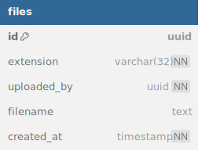

# file-service

## Описание

gRPC-сервис, отвечающий за загрузку и получение файлов.  
Не выполняет проверку прав доступа — за это отвечают вызывающие сервисы (user, homework, payment и т.д.)

Файлы хранятся во внешнем S3-совместимом хранилище.  
Сервис возвращает временные ссылки (signed URL) для загрузки и скачивания.

---

## Инфа по реализации

- при инициализации загрузки создаётся запись в БД и генерируется signed URL
- после загрузки вызывающий сервис может использовать `file_id`
- для скачивания создаётся отдельная signed URL (GET)

---

## База данных

### связи с базами данных других сервисов

- uploaded_by => users_db.users.id

---

## Описание gRPC методов

(подробнее со всеми request/response message смотрите в proto файле)

### InitUpload
Возможные ошибки:
- `INVALID_ARGUMENT`: имя файла пустое или слишком длинное

Создаёт запись файла в БД и возвращает signed URL для загрузки.  

---

### GenerateDownloadURL
Возможные ошибки:
- `NOT_FOUND`: файл не существует

Генерирует временную ссылку на скачивание файла.  

---

### GetFileMeta
Возможные ошибки:
- `NOT_FOUND`: файл не существует

Возвращает базовую информацию о файле: имя, автор, дата создания.
