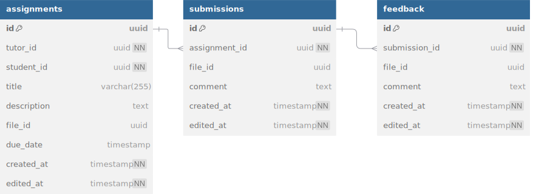

# homework_service

## Описание

gRPC-сервис, обрабатывающий назначение, выполнение и проверку домашних заданий между репетитором и учеником.

Аутентификацию и авторизацию обеспечивает API Gateway, который прокидывает user\_id и user\_role в gRPC Context.

---

## Инфа по реализации

- в assigments нет поля `status`. реализовать фильтрацию по статусам надо в бизнес логике (мб через sql запрос с джоинами)

- (делаем в последнюю очередь) реализовать механизм ивентов напоминания о заданиях:
    - периодически (раз минуту например) запускается воркер
    - ищет несданные (нет submission) задания, у которых дедлайн через сутки
    - генерируется ивент-напоминания о задании и отправляется в кафку

---

## зависимости

- file service

---

## База данных

### связи с базами данных других сервисов 

- student_id, tutor_id => users_db.users.id
- file_id => files_db.files.id

---

## Описание gRPC методов

(подробнее со всеми request/response message смотрите в proto файле) 

### CreateAssignment
Возможные ошибки:
- INVALID_ARGUMENT: поля невалидны
- FAILED_PRECONDITION: student_id не существует
- PERMISSION_DENIED: не репетитор или нет связки репетитор-ученик
    
Создаёт новое домашнее задание. Репетитор указывает ученика, название, описание, опционально: дедлайн и файл.

### UpdateAssignment
Возможные ошибки:
- NOT_FOUND: задание не найдено
- PERMISSION_DENIED: репетитор не владелец задания
- INVALID_ARGUMENT: поля невалидны

Редактирует существующее задание. Можно изменить заголовок, описание, срок, прикреплённый файл.

### DeleteAssignment
Возможные ошибки:
- NOT_FOUND: задание не найдено
- PERMISSION_DENIED: репетитор не владелец задания

Удаляет задание целиком и все сабмишны и фидбеки с ним связанные (каскадное удаление)

### ListAssignmentsByTutor
Возможные ошибки:
- PERMISSION_DENIED: tutor_id не совпадает с авторизованным пользователем
- INVALID_ARGUMENT: поля невалидны

Получает список всех заданий, назначенных конкретным репетитором. Поддерживает фильтрацию по статусам (несколько одновременно).

### ListAssignmentsByStudent
Возможные ошибки:
- PERMISSION_DENIED: student_id не совпадает с текущим пользователем
- INVALID_ARGUMENT: поля невалидны

Возвращает задания, полученные учеником. Можно указать статус (несколько), чтобы получить, например, только "непроверенные".

### ListAssignmentsByPair
Возможные ошибки:
- PERMISSION_DENIED: текущий пользователь не участник связки
- INVALID_ARGUMENT: поля невалидны

Список заданий между конкретным репетитором и учеником. Полезно для отображения истории работы с конкретным человеком.

### CreateSubmission
Возможные ошибки:
- FAILED_PRECONDITION: assignment не существует
- PERMISSION_DENIED: попытка сдачи чужой домашки
- INVALID_ARGUMENT: поля невалидны

Позволяет ученику сдать решение по заданию. Можно прикрепить файл и комментарий.

### ListSubmissionsByAssignment
Возможные ошибки:
- FAILED_PRECONDITION: assignment не существует
- PERMISSION_DENIED: текущий пользователь не участник связки
- INVALID_ARGUMENT: поля невалидны

Возвращает все сабмишны по заданию.

### CreateFeedback
Возможные ошибки:
- FAILED_PRECONDITION: submission не существует
- PERMISSION_DENIED: текущий пользователь не создатель дз
- INVALID_ARGUMENT: поля невалидны

Позволяет преподавателю оставить отзыв на конкретное решение ученика. Можно прикрепить файл (например, скрин, исправления).

### UpdateFeedback
Возможные ошибки:
- NOT_FOUND: фидбек не найден
- PERMISSION_DENIED: нельзя править чужой фидбек
- INVALID_ARGUMENT: поля невалидны

Редактирует уже созданный фидбек. Используется, если репетитор захотел дополнить или исправить свой отзыв.

### ListFeedbacksByAssignment
Возможные ошибки:
- PERMISSION_DENIED: нет доступа к заданию
- INVALID_ARGUMENT: поля невалидны

Получает все фидбеки по заданию.

### GetAssignmentFile
Возможные ошибки:
- `NOT_FOUND`: задание или файл не найдены
- `PERMISSION_DENIED`: пользователь не является участником задания

Возвращает временную ссылку на файл задания.  

### GetSubmissionFile
Возможные ошибки:
- `NOT_FOUND`: решение или файл не найдены
- `PERMISSION_DENIED`: пользователь не имеет доступа (не автор задания и не автор submission)

Возвращает временную ссылку на файл решения, загруженного учеником.  

### GetFeedbackFile
Возможные ошибки:
- `NOT_FOUND`: фидбек или файл не найдены
- `PERMISSION_DENIED`: пользователь не имеет доступа (не tutor и не student из assignment)

Возвращает временную ссылку на файл фидбека, прикреплённый репетитором.  
