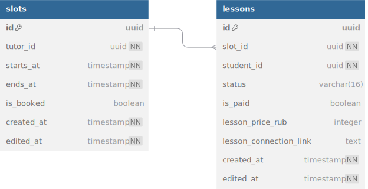

# schedule-service

## Описание

Сервис отвечает за хранение и управление расписанием репетитора, а также бронирование слотов учениками.

Аутентификацию и авторизацию обеспечивает API Gateway, который прокидывает user_id и user_role в gRPC Context.

---

## Инфа по реализации

- поле `is_booked` в слотах избыточно (можно было бы проверить в lessons), но оставлено для оптимизации
- каждый слот может быть использован только один раз (unique constraint на slot_id в lessons)
- необходимо реализовать механизм периодического обновления lessons.status: если slots.ends_at < now и lessons.status = `booked`, то lesson.status обновляется на `completed`.
- (делаем в последнюю очередь) реализовать механизм ивентов напоминания о занятиях:
    - периодически (раз в минуту например) запускается воркер по booked занятиям
    - если до занятия остался день или час, генерируется ивент-напоминание и отправляется в кафку

---

## База данных

возможные status: `booked` / `cancelled` / `completed`

### связи с базами данных других сервисов

- tutor_id, student_id => users_db.users.id

---

## Описание gRPC методов

(подробнее со всеми request/response message смотрите в proto файле)

### GetSlot
**Ошибки:**
- `NOT_FOUND`: слот не найден
- `PERMISSION_DENIED`: не владелец

Получает слот по Id.

### CreateSlot
**Ошибки:**
- `INVALID_ARGUMENT`: поля невалидны (начало позже конца, не в будущем)
- `PERMISSION_DENIED`: не репетитор

Создаёт свободный слот времени для репетитора.

### UpdateSlot
**Ошибки:**
- `NOT_FOUND`: слот не найден
- `PERMISSION_DENIED`: не владелец
- `FAILED_PRECONDITION`: слот уже забронирован

Изменяет временной интервал слота. Только если он ещё не забронирован.

### DeleteSlot
**Ошибки:**
- `INVALID_ARGUMENT`: поля невалидны
- `NOT_FOUND`: слот не найден
- `PERMISSION_DENIED`: не владелец
- `FAILED_PRECONDITION`: слот занят

Удаляет слот. Если слот уже занят, удалить нельзя.

### ListSlotsByTutor
**Ошибки:**
- `INVALID_ARGUMENT`: поля невалидны
- `PERMISSION_DENIED`: доступ к чужому расписанию

Возвращает список всех слотов преподавателя.  
Поддерживает фильтр `only_available: true` для получения только свободных.  
Может вызываться учеником — при наличии связки с репетитором (валидация в `users-service`: ResolveTutorStudentContext).

### GetLesson
**Ошибки:**
- `NOT_FOUND`: урок не найден
- `PERMISSION_DENIED`: не участник урока

Получает урок по Id.

### CreateLesson
**Ошибки:**
- `NOT_FOUND`: слот не существует
- `ALREADY_EXISTS`: слот уже занят
- `PERMISSION_DENIED`: слот не принадлежит вызывающему
- `FAILED_PRECONDITION`: tutor и student не состоят в связке

Создаёт урок в свободном слоте.  
Может быть вызван как репетитором, так и учеником.

### UpdateLesson
**Ошибки:**
- `NOT_FOUND`: урок не найден
- `PERMISSION_DENIED`: не репетитор

Позволяет изменить:
- ссылку на занятие
- цену
- реквизиты

### CancelLesson
**Ошибки:**
- `NOT_FOUND`: урок не найден
- `PERMISSION_DENIED`: не участник урока

Меняет статус урока на `cancelled`.  
Физически не удаляется.

### ListLessonsByTutor
**Ошибки:**
- `PERMISSION_DENIED`: доступ к чужому расписанию

Возвращает список всех уроков репетитора.  
Поддерживает `repeated status_filter`: `BOOKED`, `CANCELLED`, `COMPLETED`.

### ListLessonsByStudent
**Ошибки:**
- `PERMISSION_DENIED`: доступ к чужому расписанию

Возвращает список всех уроков ученика.  
Поддерживает `repeated status_filter`.

### ListLessonsByPair
**Ошибки:**
- `PERMISSION_DENIED`: нет доступа к связке

Возвращает уроки между заданным `tutor_id` и `student_id`.  
Поддерживает `repeated status_filter`.

### ListCompletedUnpaidLessons
**Ошибки:**
- `INVALID_ARGUMENT`: поля невалидны

Можно реализовать позже

Возвращает все прошедшие, но неоплаченные занятия. Внутренний метод для payment-service. Не требует авторизации