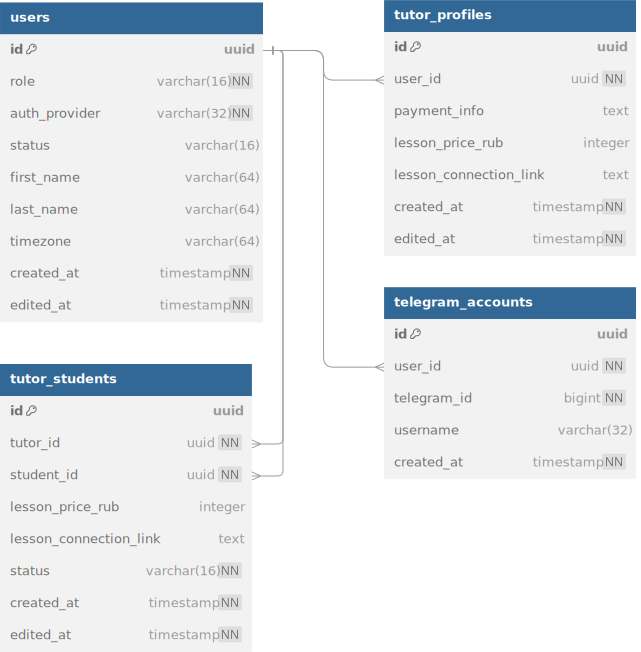

# user-service

## Описание

gRPC-сервис, отвечающий за регистрацию, авторизацию и хранение пользовательских данных.  
Поддерживает работу с профилями пользователей, профилями репетиторов и связками "репетитор — ученик".

Аутентификацию и авторизацию обеспечивает API Gateway, который прокидывает `user_id` и `user_role` в gRPC Context.  
Метод авторизации по `Authorization`-заголовку реализован в самом сервисе.

---

## Инфа по реализации

- роли: `tutor`, `student`, назначаются при регистрации, не меняются
- каждый пользователь имеет один Telegram-аккаунт, создаётся при регистрации
- профиль репетитора создаётся автоматически при регистрации с ролью `tutor`
- связка tutor-student уникальна по паре `(tutor_id, student_id)`
- метод `ResolveTutorStudentContext` используется для получения параметров взаимодействия между пользователями (цена, ссылка, реквизиты)

---

## База данных

- users.role: `tutor` / `student`
- users.status: `active` / `deleted`
- tutor_students.status: `invited` / `active`

---

## Описание gRPC методов

(подробнее со всеми request/response message смотрите в proto файле)

### RegisterViaTelegram
Возможные ошибки:
- `INVALID_ARGUMENT`: поля невалидны
- `ALREADY_EXISTS`: Telegram ID уже используется

Создаёт пользователя по данным Telegram. Также создаёт Telegram-аккаунт и профиль репетитора (если роль tutor).

### AuthorizeByAuthHeader
Возможные ошибки:
- `INVALID_ARGUMENT`: заголовок невалиден
- `UNAUTHENTICATED`: подпись не прошла или пользователь не найден

Проверяет заголовок авторизации (`Authorization: ...`) и возвращает пользователя.  
Внутренний метод. Используется только API Gateway.

### GetMe
Возвращает полную информацию о текущем пользователе.  
ID берётся из gRPC Context.

### GetUser
Возможные ошибки:
- `NOT_FOUND`: пользователь не найден

Возвращает публичную информацию о пользователе (имя, фамилия, роль) по `user_id`.

### UpdateUser
Возможные ошибки:
- `INVALID_ARGUMENT`: поля невалидны
- `PERMISSION_DENIED`: попытка изменить чужой профиль

Обновляет имя, фамилию и таймзону текущего пользователя.

### GetTutorProfileByUserId
Возможные ошибки:
- `NOT_FOUND`: профиль не найден
- `PERMISSION_DENIED`: попытка получить чужой профиль

Возвращает профиль репетитора по `user_id`.

### UpdateTutorProfile
Возможные ошибки:
- `PERMISSION_DENIED`: попытка изменить чужой профиль
- `INVALID_ARGUMENT`: поля невалидны

Обновляет цену, ссылку на занятие и реквизиты в профиле репетитора.

### CreateTutorStudent
Возможные ошибки:
- `ALREADY_EXISTS`: связка уже есть
- `PERMISSION_DENIED`: вызывающий не является репетитором
- `INVALID_ARGUMENT`: поля невалидны

Создаёт связку между репетитором и учеником, с опциональными параметрами: цена, ссылка.

### GetTutorStudent
Возможные ошибки:
- `NOT_FOUND`: связка не найдена
- `PERMISSION_DENIED`: пользователь не участник связки

Возвращает связку по паре `tutor_id` и `student_id`.

### UpdateTutorStudent
Возможные ошибки:
- `NOT_FOUND`: связка не найдена
- `PERMISSION_DENIED`: нельзя редактировать чужую связку
- `INVALID_ARGUMENT`: поля невалидны

Обновляет параметры связки: цена, ссылка, статус.

### DeleteTutorStudent
Возможные ошибки:
- `NOT_FOUND`: связка не найдена
- `PERMISSION_DENIED`: нельзя удалить чужую связку

Удаляет связку между репетитором и учеником.

### ListTutorStudents
Возможные ошибки:
- `NOT_FOUND`: репетитор не найден
- `PERMISSION_DENIED`: нельзя просматривать чужих учеников

Возвращает список всех учеников данного репетитора.

### ListTutorsForStudent
Возможные ошибки:
- `NOT_FOUND`: ученик не найден
- `PERMISSION_DENIED`: нельзя просматривать чужие связки

Возвращает список всех репетиторов, с которыми у студента есть связка.

### ResolveTutorStudentContext
Возможные ошибки:
- `NOT_FOUND`: связка не найдена или профиль не найден
- `PERMISSION_DENIED`: нельзя просматривать чужие связки

Возвращает параметры взаимодействия между репетитором и студентом:
- цена за занятие
- ссылка на урок
- реквизиты
- статус связки

### AcceptInvitationFromTutor
Возможные ошибки:
- `NOT_FOUND`: связка не найдена
- `PERMISSION_DENIED`: нельзя принять направленное другому пользователю приглашение

Меняет статус в TutorStudents
